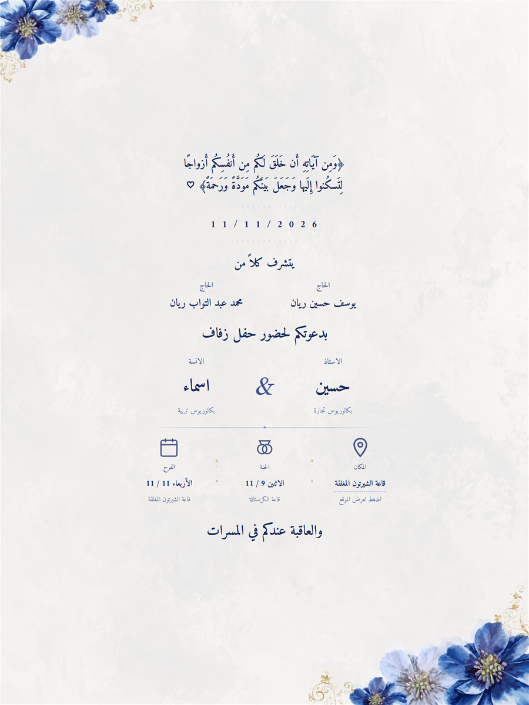

<p align="center">
  
</p>

<p align="center">
  
  
  
  
</p>

---

<h1 align="center">💍 دعوة زفاف — وبالحب نبدأ أجمل حكاية</h1>

<p align="center">
  بطاقة دعوة زفاف رقمية تفاعلية بتصميم شرقي مع أنيميشن و موسيقى خلفية ، جاهزة للنشر بنقرة واحدة.
</p>

<p align="center">
  🔗 <b>المعاينة الحيّة:</b> <a href="https://el-mokhtas.github.io/hussien/">el-mokhtas.github.io/hussien</a>
</p>

---

## ✨ المميزات

- 🎵 **موسيقى خلفية** بتشغيل تلقائي (مع تفعيل الصوت عند أول ضغطة — حسب سياسات المتصفحات) + `loop`
- 🎞️ **أنيميشن دخول** متدرّج لكل أقسام البطاقة
- 🕌 **تصميم RTL** كامل بخطوط `Amiri` و `Noto Naskh Arabic`
- 📱 **متجاوب مع الموبايل** (نفس تصميم الديسكتوب على كل الشاشات)
- 🗺️ **رابط خرائط جوجل** للمكان
- 🖼️ **Meta Tags كاملة** (`OG` + `Twitter Card`) لعرض جذّاب عند المشاركة على واتساب/فيسبوك
- 🧩 **صفر مكتبات خارجية** — HTML/CSS/JS خالص بدون أي build

## 🛠️ التقنيات

| التقنية | الاستخدام |
|---|---|
| HTML5 | هيكل البطاقة والدعوة |
| CSS3 | التصميم، الأنيميشن، الـ media queries |
| JavaScript (Vanilla) | الأنيميشن وتشغيل الموسيقى |

## 📁 هيكل المشروع

```
الدعوه/
├── index.html          ← قلب الدعوة
├── style.css           ← كل التنسيقات
├── music.mp3           ← الأغنية الخلفية
├── bg.png              ← الخلفية
├── before.png          ← الزخرفة العلوية
├── after.png           ← الزخرفة السفلية
├── line.png            ← فواصل ذهبية
└── WhatsApp Image *.jpeg ← صورة المشاركة (OG)
```

---

<p align="center">
  صُنع بـ ❤️ لـ <b>حسين & اسماء</b>
</p>
<p align="center">
  <a href="https://github.com/El-Mokhtas/hussien/blob/main/LICENSE"></a>
</p>